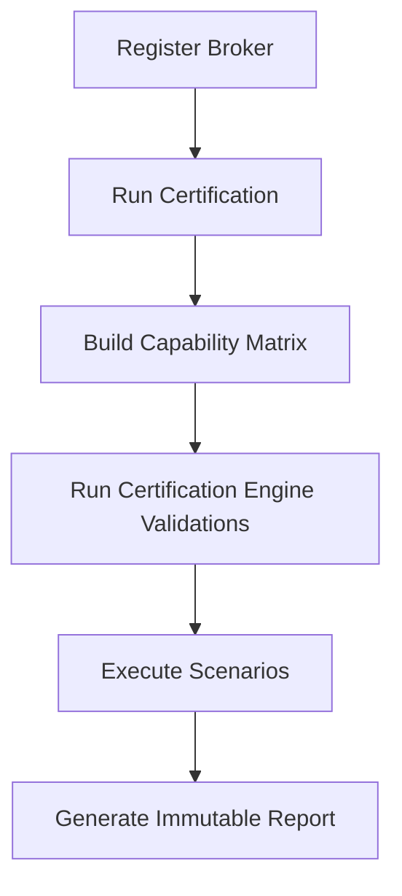

# Broker Certification Framework

## Purpose
The Broker Certification Framework guarantees that all brokers integrating with TITAN meet strict institutional-grade requirements before they are permitted to execute live or paper trades.

It ensures that brokers provide expected capabilities, adhere to required interfaces, correctly handle errors, and manage rate limits, avoiding catastrophic failures during live trading.

## Architecture
The certification framework operates strictly within the `titan.brokers.certification` package and avoids coupling with any specific broker implementation. 

### Core Components
- **Models**: Immutable, strictly typed data structures representing scenarios, results, and capabilities.
- **Certification Engine**: Orchestrates multiple sub-validators.
  - **CapabilityValidator**: Ensures the broker’s declared capabilities are sound.
  - **InterfaceValidator**: Validates required structural implementation.
  - **ScenarioValidator**: Validates scenario applicability against capabilities.
  - **ComplianceValidator**: Validates rate limits and behavioral safeguards.
- **Scenarios**: Predefined canonical tests (Authentication, Orders, Market Data, etc.).
- **Runner**: Orchestrates the execution of the Engine and tests.
- **Report Builder**: Generates the final immutable certification report.

## Certification Flow

## Scenario Categories
Scenarios are organized into several logical categories:
- **Authentication**: Valid login, invalid credentials, token integrity.
- **Session**: Session refresh, token expiry, graceful logout.
- **Market Data**: Real-time quotes, historical data availability.
- **Orders**: Limit, Market, Stop, modifying, canceling.
- **Positions**: Accurate position retrieval.
- **Holdings**: Portfolio holdings retrieval.
- **Funds**: Margin available, used margin.
- **Margin**: Dynamic margin calculation.
- **Recovery**: Disconnects, transparent retry logic.
- **Runtime**: Connection heartbeats, sustained uptime.
- **Performance**: Placement latency, execution speeds.
- **Compliance**: Rate limit adherence, back-offs.

## Report Structure
The final `BrokerCertificationReport` contains:
- **Executive Summary**: High-level score and status (`PASS`, `PASS_WITH_WARNINGS`, `PARTIAL`, `FAIL`, `NOT_APPLICABLE`).
- **Broker Information**: Environment, target broker ID, timestamp.
- **Capability Matrix**: Immutable snapshot of supported features.
- **Scenario Results**: Detailed run times and status of every executed scenario.
- **Validation Results**: Static analysis details.
- **Warnings & Limitations**: Identified non-critical issues or API quirks.
- **Recommendations**: Suggested fixes or improvements.
- **Final Certification**: The conclusive result dictating if the broker is authorized for use.

## Extension Guidelines for New Brokers
To add another broker, no modifications to this framework are required.
1. Implement the broker following the `titan.brokers` base interface.
2. The framework utilizes `BrokerFeatureDiscovery` to dynamically discover supported capabilities.
3. Run the CLI: `titan broker certify <broker_id>`.
4. The framework will test against the interface and automatically generate the comprehensive report.

For lifecycle specifics, see [Broker Compliance](BROKER_COMPLIANCE.md) and [Order Lifecycle](BROKER_ORDER_CERTIFICATION.md).
